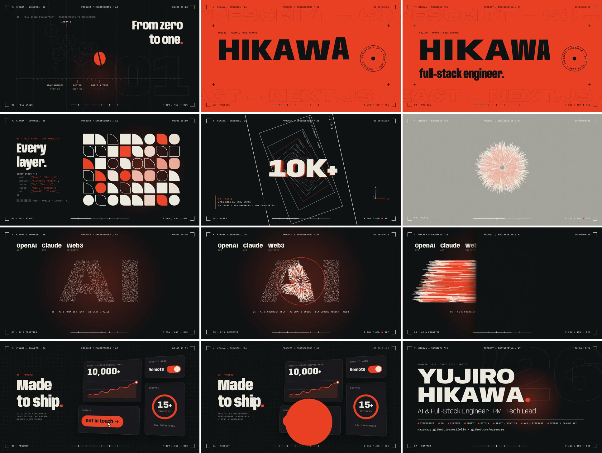
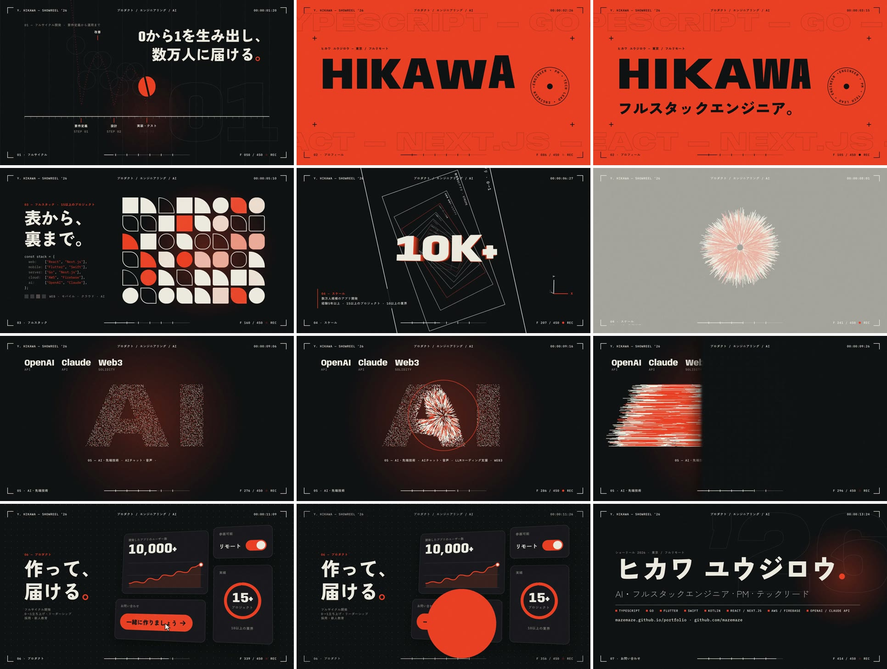

# Yujiro Hikawa — Showreel ’26 (15 s)

A 15-second, 1920×1080 / 30 fps résumé showreel for Yujiro Hikawa (Full-Stack Engineer ·
PM · Tech Lead). All text comes from the portfolio site. It is built entirely in code:
[HyperFrames](https://hyperframes.heygen.com) HTML + GSAP for picture, and a
procedural Node synth for the soundtrack. No stock footage, samples, or
plugins — every frame is a pure function of time, so renders are repeatable.




Japanese version (`showreel-ja.mp4`):



## What’s in it

| Time | Chapter | What it says | Technique |
| --- | --- | --- | --- |
| 0–2 s | 01 Full-cycle | “From zero to one.” The ball bounces through Requirements, Design, and Build & test, then launches | Physics-driven squash & stretch, onion skins, arc trace; the ball becomes an iris |
| 2–4 s | 02 Profile | HIKAWA, full-stack engineer, Tokyo / full remote; the stack scrolls behind | Letters drop on 16th notes and squash on the variable-font width axis; block wipe |
| 4–6 s | 03 Full stack | “Every layer.” The stack is shown as code (web, mobile, server, cloud, AI) | 48-cell grid: staggered waves, shape morphs, beat ripple; zoom-through |
| 6–8 s | 04 Scale | 10K+ users; 5+ years, 15+ projects, 10+ industries; real project names on the tunnel frames | CSS 3D tunnel + extruded type; fly-through into a flash |
| 8–10 s | 05 AI & frontier | AI, OpenAI / Claude API, Web3 | 4,200 seeded particles burst, assemble, shockwave, whip-pan |
| 10–12 s | 06 Product | “Made to ship.” 10,000+ users, 15+ projects, remote from Sep 2026, Get in touch | UI micro-interactions: count-ups, chart, toggle, ring, cursor press + ripple |
| 12–15 s | 07 Contact | Name, role, stack, portfolio and GitHub links | The click’s iris lands as the full stop after the name |

The soundtrack (`audio/synth.mjs`) runs at 120 BPM, so every cut sits on a bar
line (2, 4, 6, 8, 10, 12 s) and the ball’s three bounces land on beats
(0.5 / 1.0 / 1.5 s).

## Files

```
index.html          # the whole composition (one timeline; transitions cross scene boundaries)
audio/synth.mjs     # procedural soundtrack -> audio/soundtrack.wav -> soundtrack.m4a
fonts/              # Anybody (Latin + Latin Extended), IBM Plex Mono, Zen Kaku Gothic New (Japanese subset); all SIL OFL
showreel.mp4        # the rendered reel: H.264 CRF 23 + AAC, faststart, ~11 MB (fits email limits)
showreel-ja.mp4     # the Japanese version (same motion and sound)
docs/               # contact sheet + preview GIF
```

## Preview and render

Requires Node 22+ and FFmpeg.

```sh
cd showreel
npm run dev      # live preview in HyperFrames Studio
npm run check    # lint + runtime + layout + motion + contrast
npm run render   # both languages: HyperFrames masters (renders/, ~30 MB each) -> showreel.mp4 + showreel-ja.mp4
npm run render:en / render:ja   # one language only
npm run audio    # re-synthesise the soundtrack
npm run verify   # machine check of both videos: 1920x1080/30fps/450 frames/15 s, audio hits on the 2 s beat grid, HyperFrames gates
```

### Japanese version

The same composition renders in Japanese with the `lang` variable (`npm run render:ja`
does this). The Japanese copy lives in the `JA` list in `index.html`: it uses the
portfolio site’s Japanese text (`assets/js/i18n.js`, `ja`) where it exists, and
translates the English reel’s line otherwise. Latin graphic labels (HUD, badge, stack
marquee, HIKAWA) stay in English. The name and role
switch to ヒカワ ユウジロウ / AI・フルスタックエンジニア · PM · テックリード unless you pass your own.

Japanese text uses Zen Kaku Gothic New, subset to the reel’s characters plus all
hiragana and katakana (~40 KB per weight instead of ~2.3 MB). After changing the
Japanese copy, rebuild the subsets with `npm run fonts:ja` (needs
`pip install fonttools brotli`). For a name with kanji that aren’t in the reel, pass
it too: `python3 fonts/subset-ja.py "山田 太郎"`. Otherwise those kanji fall back to
the rendering machine’s system font.

### Change the end card

The end card’s name, role and contact line are composition variables (defaults:
`Yujiro Hikawa`, `AI & Full-Stack Engineer · PM · Tech Lead`,
`mazemaze.github.io/portfolio · github.com/mazemaze`). A name stays on one line at
up to 250 px; multi-word names wrap between words, at up to 210 px, when that makes
them clearly larger. A single word too long for the line shrinks to fit. Pass `"contact":""` to hide the contact line. Latin and
Latin Extended letters use Anybody, and kana plus the reel’s own kanji use Zen Kaku Gothic
New. Other characters fall back to the rendering machine’s system font.

```sh
npx --yes hyperframes@0.8.77 render --quality high \
  --variables '{"name":"Yujiro Hikawa","role":"Full-Stack Engineer","contact":"github.com/mazemaze"}' \
  --output renders/your-name.mp4
```

## Notes

- **Two encodes:** HyperFrames’ high-quality output is a ~30 MB master. The second
  pass makes the streamable share file (SSIM 0.98 against the master; the difference
  isn’t visible at 100% zoom). Keep the master if you need a higher-quality upload.
- **Fonts:** the Anybody and IBM Plex Mono `.woff2` files are the unmodified Latin / Latin
  Extended subsets served by Google Fonts (Anybody v13, IBM Plex Mono v20). The Zen Kaku
  Gothic New files are our own subsets, built by `fonts/subset-ja.py`. All are bundled
  so renders work offline.
  All three are SIL Open Font License 1.1 (see `fonts/OFL-*.txt`). “Plex” is a Reserved
  Font Name, so don’t modify and redistribute those files under that name. Zen Kaku
  Gothic New has no Reserved Font Name, so its subsets can keep that name.
